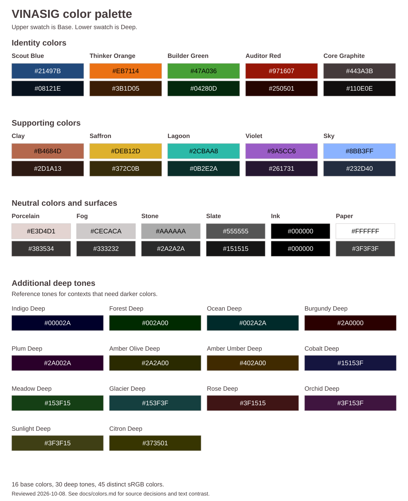

# VINASIG color palette

Palette inspired by Minecraft.

The shared palette has 16 base colors, 30 deep tones and 45 distinct sRGB Hex values. Brand Assets owns the [canonical JSON](../assets/palette.json). Web Design System adopts a revision-pinned copy for its CSS tokens and Foundations page. Both projects use the same VINASIG names and values. Original artwork and the five identity anchors are unchanged.

Use the [Hex, RGB and token reference](palette-reference.md), [JSON](../assets/palette.json) or [SVG sheet](../assets/palette.svg). These are reusable color primitives. Semantic interface tokens remain in [Web Design System](https://github.com/VINASIG/web-design-system).

## Names and roles

- Identity keeps Scout Blue, Thinker Orange, Builder Green, Auditor Red and Core Graphite.
- Support uses Clay, Saffron, Lagoon, Violet and Sky.
- Neutral uses Porcelain, Fog, Stone, Slate, Ink and Paper.
- Deep tones retain all reviewed darker values with their own names and tokens. Amber Olive Deep and Amber Umber Deep keep both distinct brown/olive tones.

Base colors and their deep tones are references, not automatic light/dark theme pairs. Deep does not mean an approved website background. Choose each actual text and surface pair together.

The current JSON uses format 2. It removes game formatting identifiers, source names and excluded base colors from the consumer palette. It records the earlier reviewed revision and palette hash for traceability. Selection and naming are design decisions. The original 45 selected Hex values have not changed.

## RGB and contrast

RGB is derived from Hex. Builder Green remains `#47A036` with RGB 71, 160, 54. Thinker Orange remains `#EB7114` with RGB 235, 113, 20. The JSON retains the two supplied RGB/Hex conflicts by VINASIG identity ID.

Use Core Graphite on Paper or Porcelain for general text. Scout Blue on Paper passes normal text contrast. White text on Thinker Orange or Builder Green fails that threshold, while Ink text on those solid fills passes. Check every actual context rather than assigning text color from a hue name.

The [contrast table](palette-reference.md#base-and-deep-contrast) follows the W3C sRGB formula. Normal text needs at least 4.5 to 1. Decisions use the unrounded result. See [WCAG text contrast](https://www.w3.org/WAI/WCAG22/Understanding/contrast-minimum.html) and [non-text contrast](https://www.w3.org/WAI/WCAG22/Understanding/non-text-contrast.html).

## Rebuild and preserve

`npm run build:palette` regenerates the SVG and Markdown from the canonical JSON. It never accepts catalog changes. An authorized data or export change needs a separately reviewed catalog update. `npm run check:palette` rejects a mismatched export. Archive checks continue to protect all original files and historical evidence.

The SVG contains literal colors without scripts, external resources or embedded font software. Its text requests Space Grotesk. Existing brand rights and font notices remain separate. The earlier research audit is historical evidence, while current product naming follows the owner's shared-palette instruction of 8 October 2026.
